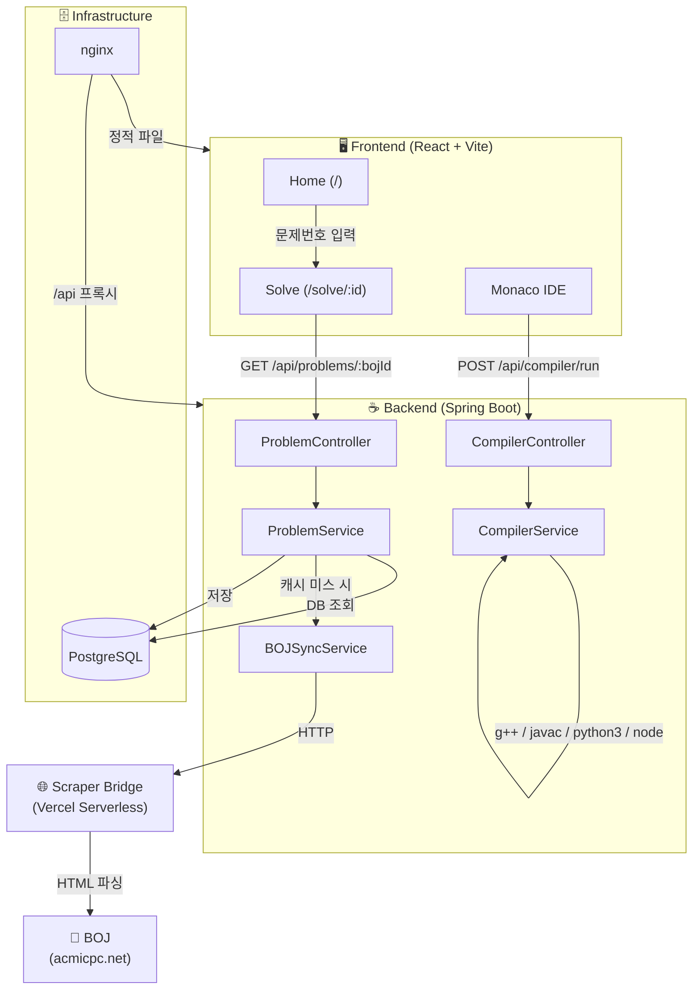
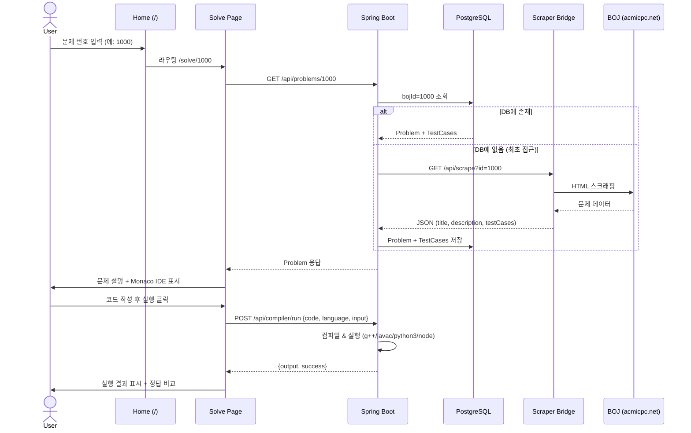

# AlgoArena - Code Manager

백준 온라인 저지(BOJ)와 연동되는 C++ / Java / Python / JavaScript 코딩 연습 플랫폼입니다.
BOJ 문제를 자동으로 스크래핑하여 웹 IDE에서 직접 풀고, 예제 테스트케이스로 검증할 수 있습니다.

---

## 🏗 Architecture

### 시스템 구성도



### 문제 풀이 플로우



---

## 🛠 Tech Stack

### Frontend (`/client`)
- **React 18** + **Vite** + **TypeScript**
- **Tailwind CSS** + **shadcn/ui** (UI 컴포넌트)
- **Monaco Editor** (코드 에디터)
- **TanStack Query** (서버 상태 관리)
- **wouter** (라우팅)

### Backend (`/server`)
- **Java 17** + **Spring Boot 3.4.1**
- **Spring Data JPA** (PostgreSQL)
- **Jsoup** (BOJ 문제 서버 사이드 스크래핑)
- **Lombok**
- **Gradle** (Kotlin DSL)

### Scraper Bridge (`/scraper-bridge`)
- **Vercel Serverless Functions** (Node.js)
- **axios** + **cheerio** (BOJ HTML 파싱)
- BOJ의 IP 차단을 우회하기 위한 프록시 스크래퍼

### Shared (`/shared`)
- **Drizzle ORM** (DB 스키마 & 타입 정의)
- 프론트엔드에서 타입 참조용으로 사용 (백엔드는 JPA 엔티티를 별도 관리)

### Infrastructure
- **Docker** + **Docker Compose** (로컬 개발 DB / 프로덕션 배포)
- **nginx** (프로덕션 프론트엔드 서빙 + API 리버스 프록시)
- **PostgreSQL 16**

---

## 📂 Project Structure

```
psgrammers/
├── client/                          # React 프론트엔드
│   ├── src/
│   │   ├── pages/                   # Home, Solve
│   │   ├── components/              # IDE, TierBadge + shadcn/ui
│   │   ├── hooks/                   # use-compiler, use-problems, use-toast
│   │   └── lib/                     # queryClient, utils, tier-utils
│   ├── package.json
│   └── vite.config.ts               # 포트 5001, /api → :8080 프록시
│
├── server/                          # Spring Boot 백엔드
│   ├── src/main/java/com/algoarena/
│   │   ├── controller/              # ProblemController, CompilerController
│   │   ├── service/                 # CompilerService, BOJSyncService, ProblemService
│   │   ├── entity/                  # Problem, TestCase (JPA 엔티티)
│   │   ├── dto/                     # Request/Response DTOs (CompileRequest, CompileResponse, SyncProblemRequest)
│   │   └── repository/              # ProblemRepository
│   ├── src/main/resources/
│   │   └── application.properties   # DB 접속 정보 (포트 5433)
│   └── build.gradle.kts
│
├── scraper-bridge/                  # Vercel 서버리스 BOJ 스크래퍼
│   ├── api/scrape.js                # ?id=<bojId> 로 문제 데이터 반환
│   ├── package.json
│   └── vercel.json
│
├── shared/                          # 공유 타입 & 스키마
│   ├── schema.ts                    # Drizzle 테이블 정의 (problems, testCases)
│   └── routes.ts                    # API 경로 정의
│
├── deploy/                          # 프로덕션 배포 설정
│   ├── Dockerfile.backend           # Spring Boot + g++/javac/python3/node 포함
│   ├── Dockerfile.frontend          # Vite 빌드 → nginx 서빙
│   ├── docker-compose.prod.yml      # DB + Backend + Frontend 풀스택 구성
│   ├── nginx.conf                   # SPA 라우팅 + /api 리버스 프록시
│   └── .env.example                 # 환경변수 템플릿
│
├── docker-compose.yml               # 로컬 개발용 PostgreSQL (포트 5433)
└── .gitignore
```

---

## 🚀 Getting Started

### Prerequisites
- **Docker** (PostgreSQL 컨테이너용)
- **Java 17** or higher
- **Node.js 18** or higher

### 1. 데이터베이스 실행

```bash
# 프로젝트 루트에서
docker compose up -d
```

PostgreSQL이 `localhost:5433`에서 실행됩니다. (DB 이름: `psgrammers`)

### 2. 백엔드 실행 (포트 8080)

```bash
cd server
chmod +x gradlew    # 최초 1회
./gradlew bootRun
```

### 3. 프론트엔드 실행 (포트 5001)

```bash
cd client
npm install         # 최초 1회
npm run dev
```

**http://localhost:5001** 에서 확인할 수 있습니다.
프론트엔드의 `/api` 요청은 Vite 프록시를 통해 `localhost:8080`으로 전달됩니다.

### 환경변수

로컬 개발 시 별도 `.env` 설정이 필요 없습니다. 기본값이 `application.properties`에 지정되어 있습니다.

| 변수 | 기본값 | 설명 |
|------|--------|------|
| `SPRING_DATASOURCE_URL` | `jdbc:postgresql://localhost:5433/psgrammers` | DB 접속 URL |
| `SPRING_DATASOURCE_USERNAME` | `postgres` | DB 사용자 |
| `SPRING_DATASOURCE_PASSWORD` | `postgres` | DB 비밀번호 |

프로덕션 배포 시에는 `deploy/.env.example`을 참고하여 `.env` 파일을 생성하세요.

---

## 🧪 Key Features

- **BOJ 문제 동기화**: 백준 문제 번호를 입력하면 자동으로 문제/테스트케이스를 스크래핑
- **웹 IDE**: Monaco Editor 기반 C++, Java, Python, JavaScript 코드 편집
- **코드 컴파일 & 실행**: 서버에서 `g++`, `javac`, `python3`, `node`를 사용하여 안전하게 실행
- **예제 테스트**: 스크래핑된 예제 입출력으로 자동 정답 비교

---

## 📡 API Endpoints

### Problems

| Method | Path | Description |
|--------|------|-------------|
| `GET` | `/api/problems` | 전체 문제 목록 조회 |
| `GET` | `/api/problems/:id` | 특정 문제 조회 (없으면 BOJ에서 자동 스크래핑) |
| `POST` | `/api/problems/sync` | BOJ 문제 수동 동기화 (`{ bojId: number }`) |
| `DELETE` | `/api/problems/:id` | 문제 삭제 |

### Compiler

| Method | Path | Description |
|--------|------|-------------|
| `POST` | `/api/compiler/run` | 코드 컴파일 & 실행 (`{ code, language, input? }`) |

### Scraper Bridge (Vercel)

| Method | Path | Description |
|--------|------|-------------|
| `GET` | `/api/scrape?id=<bojId>` | BOJ 문제 스크래핑 (Vercel 서버리스) |

---

## 🚀 Git 브랜치 전략

이 프로젝트는 `main` + `dev` + `feature/` 3단 브랜치 전략을 사용합니다.

| 브랜치 | 역할 |
|--------|------|
| `main` | 상용(Production). 항상 배포 가능한 상태 |
| `dev` | 개발(Development). 모든 개발의 기준점 |
| `feature/<이름>` / `fix/<이름>` | 기능 개발 또는 버그 수정. 완료 후 `dev`로 PR |

**워크플로우:**
1. GitHub Issue 생성
2. `dev`에서 작업 브랜치 생성 (`feature/#번호`)
3. 작업 완료 후 `dev` 브랜치로 Pull Request 생성
4. 리뷰 및 병합 후 작업 브랜치 삭제

---

## 🐳 프로덕션 배포

```bash
cd deploy
cp .env.example .env
# .env 파일에서 POSTGRES_USER, POSTGRES_PASSWORD 수정

docker compose -f docker-compose.prod.yml up -d --build
```

배포 구성:
- **Frontend**: Vite 빌드 → nginx (SPA 라우팅 + API 리버스 프록시)
- **Backend**: Spring Boot JAR + g++/javac/python3/node 런타임 포함
- **Database**: PostgreSQL 16 (볼륨 마운트로 데이터 영속화)
